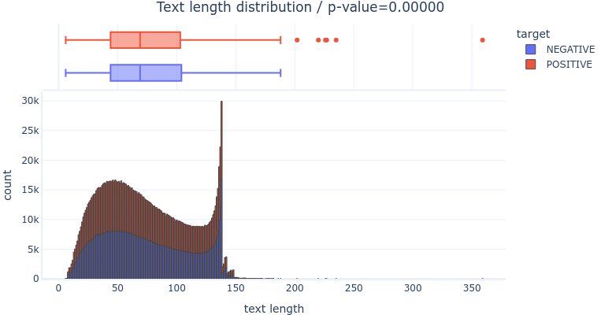
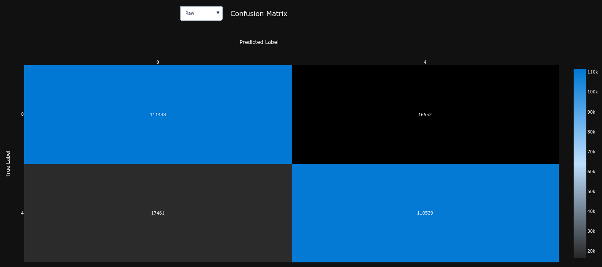
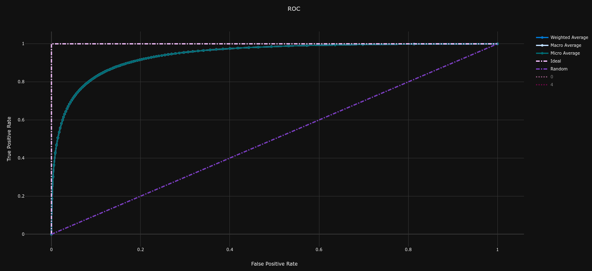
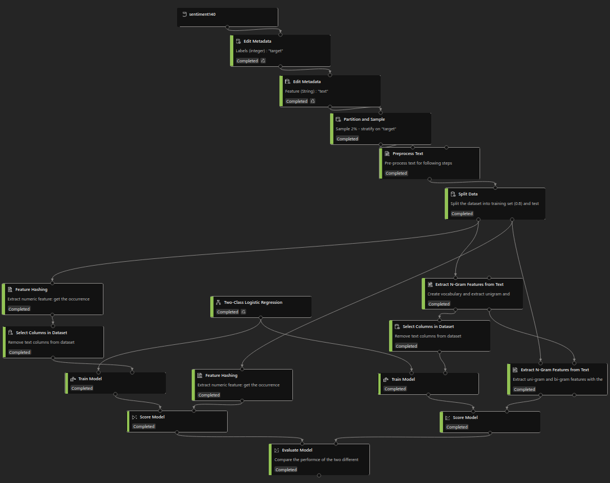
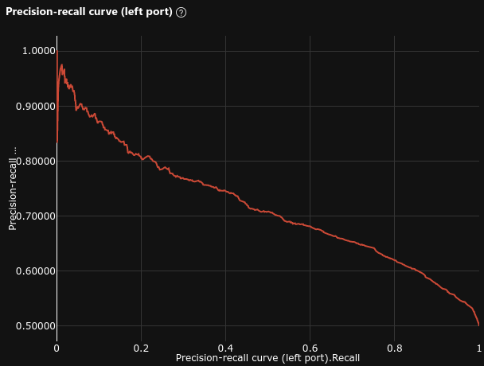
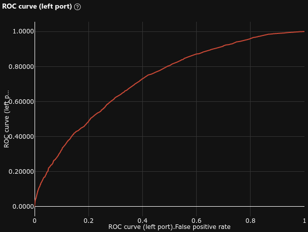
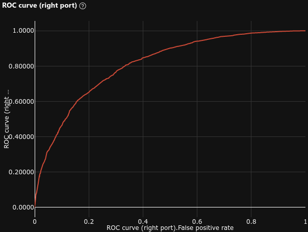
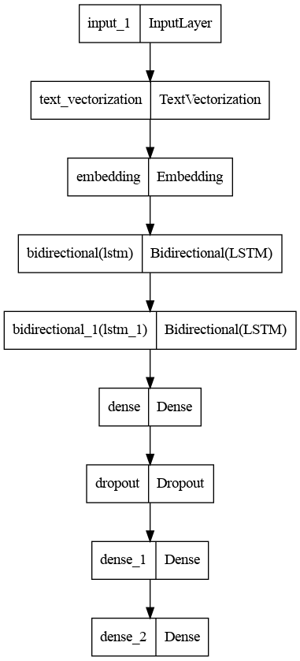
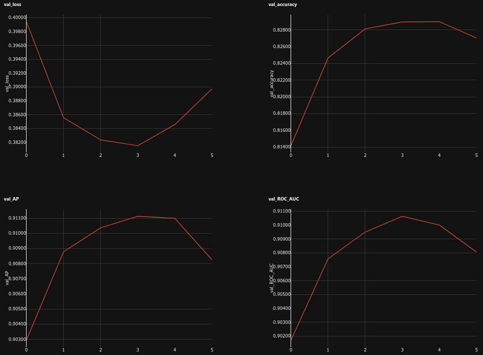
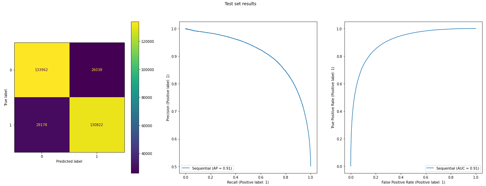

# Comparing Azure Tools for Sentiment Analysis

Imagine you are the head of Public Relations for a famous company. You want to prevent all the "bad buzz" that could affect the image of your company.
To achieve this, you would need to be able to detect _NEGATIVE_ messages on the Internet in order to act before the word spreads.

_Sentiment Analysis_ is one of the most classic [NLP] problems : **Given a piece of text, would you say its rather _POSITIVE_ or _NEGATIVE_ ?**

It seems almost natural to a human mind to classify simple sentences :

> "I love my friends because they make me happy everyday!" 👍

> "My dog died today, I'm so sad..." 👎

But not all sentences are so "simple".

> "OMG this is soooooooo sick ! Shut up and take my money XD" 🤔

There are multiple challenges that can make this task much more difficult :

- **language** : the given sentence could be in any language, potentially one you don't understand
- **language quality** : even if you know the language, the sentence could be written in a very un-intelligible way (with spelling, conjugation, grammar, syntax errors, ...)
- **language technique** : even in a perfectly well written English, the author could use a rhetorical device to imply a different meaning than the literal sense of the words (humor, derision, irony, sarcasm, ...)
- **context** : taking a sentence out of its context can completely change its meaning
- **subjectivity** : different people will interpret the same sentence differently depending on their personal way of thinking

In this article, we are going to cover different **Azure** services that we can use to predict the sentiment of **tweets**.

**_Spoiler_** : Each Azure service has its own purpose and offers more or less simplicity at the cost of control over the underlying prediction model.

_All the code is available in [Air Paradis : Detect bad buzz with deep learning]._

## Table of content

- [Exploratory Data Analysis](#exploratory-data-analysis)
- [Protocol](#protocol)
- [AI as a Service](#ai-as-a-service)
- [Automated ML](#automated-ml)
- [Designer](#designer)
- [Notebooks](#notebooks)
- [Conclusion](#conclusion)

## Exploratory Data Analysis

_Complete code available in [notebook.ipynb](https://fleuryc.github.io/OC_AI-Engineer_P7_Detect-bad-buzz-with-deep-learning/notebook.html)_

In this section, we are going to perform an [EDA] to understand the _text_ and _target_ variables.

The data we are going to use is [Kaggle - Sentiment140] dataset :

- **text** : 1.6 million tweets
  - low language quality : many Twitter specific words ("RT", @username, #hashtags, urls, slang, ... )
- **target** : binary categorical variable representing the sentiment of the tweet
  - `0` = _NEGATIVE_
  - `4` = _POSITIVE_

### Target variable

Let's have a look at how the _target_ variable is distributed.

The _target_ variable is perfectly **balanced** :

### Text variable

Let's have a look at what the _text_ variable looks like.

Examples :

> "@SexyLexy54321 I dont wanna look like a clown!! lol I dont have yellow." -- _@LucasLover321_

> "@Yveeeee And try to get me autographs, okay? " -- _@sarahroters_

> "goodnight to everyone live at other side of world it's sunny in here =]" -- _@dizaynBAZ_

#### Text length

_NEGATIVE_ tweets are slightly (not significantly) **longer** than POSITIVE tweets.

In both classes, there are **two modes** :

- _~45 characters_ and _138 characters_ (the maximum allowed at the time the data was extracted) :

- _~7 words_ and _~20 words_ :

#### Words importance

Let's see what words are most **important** in the _text_ variable.

After cleanig the text (lowercase, stopwords, [SpaCy lemmatization]), we can see the most **common words** ([Tf-Idf] weighted) in the dataset :

#### Topic modeling

Let's see what **topics** (group of words frequently found together) are **important** in the _text_ variable.

Running a [LSA] on the cleaned text, we can identify **topics** :

Running a simple [Logistic Regression], we can measure the **importance** of each topic towards the target variable :

We can see that the most important topics are :

- _NEGATIVE_ topics :
  - topic #3 : "work"
  - topic #6 : "miss"
  - topic #10 : "want", "get", "home", "sleep"
- _POSITIVE_ topics :
  - topic #2 : "thank"
  - topic #7 : "love"
  - topic #4 : "work", "good", "morning", "thank"
  - topic #8 : "go", "love", "sleep", "bed"

## Protocol

We are going to split our dataset into a _train_ and a _test_ datasets, and compare the classification results according to different [binary classification metrics] :

- **Confusion Matrix** : common way of presenting _True Positive (TP)_, _True Negative (TN)_, _False Positive (FP)_ and _False Negative (FN)_ predictions.
- **Precision** : measures how many observations predicted as positive are in fact positive.
- **Recall** or **Sensitivity** : measures how many observations out of all positive observations have we classified as positive.
- **Specificity** : measures how many observations out of all negative observations have we classified as negative.
- **Accuracy** : measures how many observations, both positive and negative, were correctly classified.
- **F1-score**: combines _Precision_ and _Recall_ into one metric.
- **Average Precision (AP)** : average of precision scores calculated for each recall threshold.
- **ROC AUC** : tradeoff between _True Positive Rate (TPR)_ and _False Positive Rate (FPR)_.

## AI as a Service

_Complete code available in [3_azure_sentiment_analysis.ipynb](https://fleuryc.github.io/OC_AI-Engineer_P7_Detect-bad-buzz-with-deep-learning/3_azure_sentiment_analysis.html)_

In this section, we are going to evaluate Azure's [AIaaS] _fully-managed cloud service_ : [Azure Cognitive Services - Sentiment Analysis API].

Before using Azure's _Sentiment Analysis API_, we need to create a _Language_ resource with the standard (S) pricing tier, as explained in the [Quickstart: Sentiment analysis and opinion mining].

### Data preparation

Using a Azure's _Sentiment Analysis API_ does not require any data preparation.
We just need to send the _text_ we want to analyze to the API, and it will return the most likely sentiment label (_POSITIVE_, _NEGATIVE_ or _NEUTRAL_), as well as confidence scores for each label.

### Model selection

Azure's fully managed Cognitive Service is a _black box_. It uses **Microsoft's best AI models** to perform the analysis, but we have no control over it.

The best information we can get is from Azure's documentation, especially [Transparency note for Sentiment Analysis].

### Model training

The underlying model is **pre-trained** and we can't train or fine-tune it ourselves.

### Classification results

We ony tested the model on 10,000 tweets in order to limit the cost of this experiment.

- **Accuracy** : 0.714400
- **F1** : 0.729135
- **Precision** : 0.693362
- **Recall** or **Sensitivity** : 0.768800
- **Specificity** : 0.660000
- **Average Precision** : 0.74
- **ROC AUC** : 0.77

### Pros

- no Data Science or Machine Learning experience required
- always using Microsoft's up-to-date state-of-the-art model
- very easy to set-up and use
- no additional costs (model selection, training, deployment, ...)
- very cheap for small projects (cf. [Cognitive Service for Language pricing])
- possible to make use of additional features like [Opinion Mining] to improve the understanding of the text's miwed sentiments

### Cons

- no control over the model
- the model is not well-balanced (training an other classification model on top of the confidence scores could prevent this bias)
- cost can become high for large projects (cf. [Cognitive Service for Language pricing])
- not suitable for critical or highly confidential data (though the model can be deployed on-premise : [Install and run Sentiment Analysis containers])
- requires an HTTP call to the API, which introduces a latency and potential security risks (though the API can be deployed on-premise : [Install and run Sentiment Analysis containers])

## Automated ML

_Complete code available in [6_azureml_automated_ml.ipynb](https://fleuryc.github.io/OC_AI-Engineer_P7_Detect-bad-buzz-with-deep-learning/6_azureml_automated_ml.html)_

In this section, we are going to evaluate AzureML Studio's [Automated ML].

Before using the service, we need to create a [Workspace], as explained in the [Tutorial: Train a classification model with no-code AutoML in the Azure Machine Learning studio].

### Data preparation

Using a Azure's _Automated ML_ service does not require any data preparation.
The data has just to be imported in the _Workspace_ as a [Dataset].

### Model selection

This where the magic actually happens.

The _Automated ML_ service will **automatically** build, train and optimize hyper-parameters of many [Feature Engineering] methods and _classification models_.

For this experiment, we chose to use the following options :

- _Deep Learning Featurization_ : **Enabled** (requires GPU capability)
  - this option is specific to text pre-processing and will integrate a _BERT_ model to extract the embeddings of the words in the text (cf. [BERT integration in automated ML])
- _Primary metric_ : **AUC weighted**
- _Training job time (hours)_ : **10 hours** (in order to limit the cost of this experiment)

### Model training

Each model created by the Automated ML service is trained automatically, nothing to do here.

### Classification results

The service has tested and compared multiple algorithms before selecting the best one :

The best model is a [LightGBM] with [MaxAbsScaler], with a fine-tuned _BERT_ model :

| Confusion Matrix                                                                              | Precision Recall Curve (AP = 0.942)                                                                       | ROC Curve (AUC = 0.942)                                            |
| --------------------------------------------------------------------------------------------- | --------------------------------------------------------------------------------------------------------- | ------------------------------------------------------------------ |
|  |  |  |

- **Accuracy** : 0.867137
- **F1** : 0.867608
- **Precision** : 0.870689
- **Recall** or **Sensitivity** : 0.864549
- **Specificity** : 0.869763
- **Average Precision** : 0.942
- **ROC AUC** : 0.942

### Pros

- the classification results are very good
- the model is very well balanced
- the model is actually fitted to the domain data
- no Data Science or Machine Learning experience required, but you must be familiar with using cloud services
- limited cost : once the best model has been identified, re-training it can be quite fast and in-expensive

### Cons

- the AutoML experiment can be expensive (but controlled) : you need to pay for the training and evaluation of many models before the best one is identified
- once the best model has been identified, you need to deploy it to be able to use it in production, which requires Cloud Infrastructure skills

## Designer

_Complete code available in [7_azureml_designer.ipynb](https://fleuryc.github.io/OC_AI-Engineer_P7_Detect-bad-buzz-with-deep-learning/7_azureml_designer.html)_

In this section, we are going to evaluate AzureML Studio's [Designer].

Before using the service, we need to create a [Workspace], as explained in the [Tutorial: Designer - train a no-code regression model].

This is what our pipeline looks like :

### Data preparation

Using the _Designer_'s UI, we created multiple data pre-processing steps :

- [Edit Metadata] : columns renaming
- [Partition and Sample] : data sampling to reduce the dataset size
- [Preprocess Text] : text cleaning (special characters removal, stopwords, lowercase, lemmatization, ...)
- [Split Data] : data splitting into _train_ and _test_ datasets

At this stage, we will compare two _text feature extraction_ methods :

- [Feature Hashing] : simple convertion of text tokens into a numeric representation
- [Extract N-Gram Features] : take into account the consecutive tokens

### Model selection

In this experiment, we will only use the simple [Two-Class Logistic Regression].

### Model training

We simply use the [Train Model component] to train our models on the _train_ dataset.

### Classification results

The models are scored thanks to the [Score Model] component, and the results are displayed thanks to the [Evaluate Model] component.

The test dataset goes through the same text pre-processing and vectorization steps as the training dataset, before being used to test the model.

| Model           | Confusion Matrix                                                                                  | AP    | Precision Recall Curve                                                                                              | ROC AUC | ROC Curve                                                                    |
| --------------- | ------------------------------------------------------------------------------------------------- | ----- | ------------------------------------------------------------------------------------------------------------------- | ------- | ---------------------------------------------------------------------------- |
| Feature Hashing |  | 0.663 |  | 0.726   |  |
| N-Gram Features |           | 0.723 |           | 0.811   |           |

We can see that the **N-Gram Features** model performs better than the **Feature Hashing** model.

- **Accuracy** : 0.730469
- **F1** : 0.734819
- **Precision** : 0.723147
- **Recall** or **Sensitivity** : 0.746875
- **Specificity** : 0.714063
- **Average Precision** : 0.723
- **ROC AUC** : 0.811

The results here are not really relevant to our article, since we didn't design a very performant model.
The goal was to demonstrate the use of the _Designer_'s UI.

We could have improved the results by :

- using more data for training (change the sampling rate)
- testing different models (cf. [How to select algorithms for Azure Machine Learning]) :
  - [Averaged Perceptron]
  - [Boosted Decision Tree]
  - [Decision Forest]
  - [Neural Network]
  - [Support Vector Machine]
- tuning the hyper-parameters of the model (cf. [Tune Model Hyperparameters])

### Pros

- the model is actually fitted to the domain data
- the results of each steps are cached to be reused in a future run (if the previous steps are unchanged)
  - this accelerates next runs and saves on compute time/money
- it is possible to view (part of) the results of each step after a run
  - this helps understand what is actually happening during a step
- no coding skills required, but Data Science and Machine Learning experience are necesary to design a performant model and you still need to be familiar with cloud services

### Cons

- you need the same amount of trial and error to find the best model as with classic Machine Learning
- there is no way to easily version your pipeline
- you need to be familiar with drag-and-drop pipeline designing UIs
- once you are satisfied with your model, you need to deploy it to be able to use it in production, which requires Cloud Infrastructure skills

## Notebooks

_Complete code available in [9_azureml_notebooks.ipynb](https://fleuryc.github.io/OC_AI-Engineer_P7_Detect-bad-buzz-with-deep-learning/9_azureml_notebooks.html)_

In this section, we are going to evaluate AzureML Studio's [Notebooks].

Before using the service, we need to create a [Workspace], as explained in the [Tutorial: Train and deploy an image classification model with an example Jupyter Notebook].

In this experiment, we will build, train, deploy and test a custom _Deep Neural Network (DNN)_ to expose a _REST API_ for our tweets sentiment prediction.

The code deployed in the Notebooks environment consists of :

- [main.ipynb](https://fleuryc.github.io/OC_AI-Engineer_P7_Detect-bad-buzz-with-deep-learning/9_azureml_notebooks/main.html) : this is the main Notebook where our data is prepared, our model is built, trained, deployed and tested
  - **Prepare** : prepare the data for our model
  - **Train** : we use the best model from [8_keras_neural_networks.ipynb](https://fleuryc.github.io/OC_AI-Engineer_P7_Detect-bad-buzz-with-deep-learning/9_azureml_notebooks/8_keras_neural_networks.html) : _Stacked Bidirectional-LSTM layers on Embedded text_
  - **Deploy** : we deploy the model in an _ACI (Azure Compute Instance)_, which will expose a _REST API_ to query our model for inference
  - **Test** : we run a `POST` query to check that our model works
- [score.py](https://github.com/fleuryc/OC_AI-Engineer_P7_Detect-bad-buzz-with-deep-learning/blob/main/notebooks/9_azureml_notebooks/score.py) : this is the code deployed in the ACI for inference
  - `init()` : load the registered model
  - `run(raw_data)` : process data sent to the _REST API_ and predict the sentiment with the loaded model
- [conda_dependencies.yml](https://github.com/fleuryc/OC_AI-Engineer_P7_Detect-bad-buzz-with-deep-learning/blob/main/notebooks/9_azureml_notebooks/conda_dependencies.yml) : this defines the dependencies that must be installed in the _Inference_ environment

This is what our model looks like :

### Data preparation

This part is implemented in the [main.ipynb](https://fleuryc.github.io/OC_AI-Engineer_P7_Detect-bad-buzz-with-deep-learning/9_azureml_notebooks/main.html) notebook :

- the data is loaded from the _Dataset_ in the _Workspace_ thanks to the `azureml` library
- no need for data preparation, since the `text_vectorization` and `embedding` layers of our DNN will do the job.

### Model selection

In this experiment, we don't do any model selection.
The selected model is the best of several _Artificial Neural Network (ANN)_ models compared in the [8_keras_neural_networks.ipynb](https://fleuryc.github.io/OC_AI-Engineer_P7_Detect-bad-buzz-with-deep-learning/9_azureml_notebooks/8_keras_neural_networks.html) notebook.

### Model training

We simply train our model on the _train_ dataset with Keras `fit()` method.

We log the training run with _MLflow_ (cf. [Track ML models with MLflow and Azure Machine Learning]).
This allows to view the metrics evolution during training epochs in AzureML Studio :

### Model deployment

Once trained, registering our model in our _Workspace_ with _MLflow_ also allows us to easily deploy our model as a _REST API_ in Azure (cf. [Deploy MLflow models as Azure web services])

To achieve that, we use `azureml` library to :

- create an [Environment] from our `conda_dependencies.yml` file
- fetch our trained model from our _Workspace_
- create an [ACI] web service
- create an _Inference_ configuration from our `score.py` file
- actually **deploy** our model in the created _ACI_ environment, with the given _Inference_ configuration.

Once the inference environment is started, we can send the requests to the endpoint. The `run(raw_data)` will process the input text and predict its sentiment with our model.

### Classification results

The performances of this model are computed in the [8_keras_neural_networks.ipynb](https://fleuryc.github.io/OC_AI-Engineer_P7_Detect-bad-buzz-with-deep-learning/9_azureml_notebooks/8_keras_neural_networks.html) notebook.

- **Accuracy** : 0.827450
- **F1** : 0.825740
- **Precision** : 0.834005
- **Recall** or **Sensitivity** : 0.817638
- **Specificity** : 0.837263
- **Average Precision** : 0.910
- **ROC AUC** : 0.910

The results here are not really relevant to our article, even if they are quite good.
The goal was to demonstrate the use of _AzureML Notebooks_ and how to deploy a model in production.

### Pros

- the model is actually fitted to the domain data
- you can easily version your code, and a peer can easily review it
- it is possible to view the metrics evolution during training
- this method offers the same flexibility, control and developer experience as coding in JupyterLab, with the addition :
  - to be able to adapt the available ressources (add more CPU, GPU disk or memory)
  - to be fully integrated in Azure, thus allowing to easily deploy models (cf. [Deploy machine learning models to Azure]) and view experiments results in AzureML Studio

### Cons

- this doesn't find the best model for you
- you need to have Data Science and Machine Learning experience to build your model
- once you are satisfied with your model, you need to deploy it to be able to use it in production, which requires Cloud Infrastructure skills

## Conclusion

In our context, the best course of actions was to use _Automated ML_ to build a very efficient model, and deploy it in production with _AzureML Notebooks_.

In this article, we have seen :

- how to very easily **set-up an AI serice** using _Azure Cognitive Services_ with zero techical knowlege
- how to very easily **create a very performant prediction model** using _AzureML Automated ML_ with no Data Science or Machine Learning knowledge (but a good understanding of Azure Studio and AutoML)
- how to **build a data processing and model training and evaluation pipeline** using _AzureML Designer_ with no coding skills (but a good knowledge of Data Science and Machine Learning)
- how to **develop, train and deploy in production** a custom model using _AzureML Notebooks_

Each AzureML service has its own purpose and offers more or less simplicity at the cost of control over the model.

[nlp]: https://en.wikipedia.org/wiki/Natural_language_processing "Natural Language Processing"
[kaggle - sentiment140]: https://www.kaggle.com/kazanova/sentiment140 "dataset with 1.6 million tweets nad their sentiment"
[eda]: https://en.wikipedia.org/wiki/Exploratory_data_analysis "Exploratory Data Analysis"
[binary classification metrics]: https://towardsdatascience.com/the-ultimate-guide-to-binary-classification-metrics-c25c3627dd0a "Binary classification metrics"
[aiaas]: https://www.toolbox.com/tech/cloud/articles/artificial-intelligence-as-a-service/ "Artificial Intelligence as a Service"
[api]: https://en.wikipedia.org/wiki/API "Application Programming Interface"
[azure cognitive services - sentiment analysis api]: https://docs.microsoft.com/en-us/azure/cognitive-services/language-service/sentiment-opinion-mining/overview#sentiment-analysis "Azure Sentiment Analysis API"
[quickstart: sentiment analysis and opinion mining]: https://docs.microsoft.com/en-us/azure/cognitive-services/language-service/sentiment-opinion-mining/quickstart "Quickstart: Sentiment analysis and opinion mining"
[transparency note for sentiment analysis]: https://docs.microsoft.com/en-us/legal/cognitive-services/language-service/transparency-note-sentiment-analysis "Transparency note for Sentiment Analysis"
[cognitive service for language pricing]: https://azure.microsoft.com/en-us/pricing/details/cognitive-services/language-service/ "Cognitive Service for Language pricing"
[opinion mining]: https://docs.microsoft.com/en-us/azure/cognitive-services/language-service/sentiment-opinion-mining/overview#opinion-mining "Opinion Mining"
[install and run sentiment analysis containers]: https://docs.microsoft.com/en-us/azure/cognitive-services/language-service/sentiment-opinion-mining/how-to/use-containers "Install and run Sentiment Analysis containers"
[automated ml]: https://docs.microsoft.com/en-us/azure/machine-learning/concept-automated-ml "Azure Studio Automated ML"
[tutorial: train a classification model with no-code automl in the azure machine learning studio]: https://docs.microsoft.com/en-us/azure/machine-learning/tutorial-first-experiment-automated-ml "Tutorial: Train a classification model with no-code AutoML in the Azure Machine Learning studio"
[workspace]: https://docs.microsoft.com/en-us/azure/machine-learning/concept-workspace "What is an Azure Machine Learning workspace?"
[dataset]: https://docs.microsoft.com/en-us/azure/machine-learning/concept-data#datasets "Reference data in storage with datasets"
[feature engineering]: https://en.wikipedia.org/wiki/Feature_engineering "Feature Engineering"
[bert integration in automated ml]: https://docs.microsoft.com/en-us/azure/machine-learning/how-to-configure-auto-features#bert-integration-in-automated-ml "BERT integration in automated ML"
[lightgbm]: https://lightgbm.readthedocs.io/en/latest/pythonapi/lightgbm.LGBMClassifier.html "LightGBM"
[maxabsscaler]: https://scikit-learn.org/stable/modules/generated/sklearn.preprocessing.MaxAbsScaler.html "MaxAbsScaler"
[designer]: https://docs.microsoft.com/en-us/azure/machine-learning/concept-designer "Azure Studio Designer"
[tutorial: designer - train a no-code regression model]: https://docs.microsoft.com/en-us/azure/machine-learning/tutorial-designer-automobile-price-train-score "Tutorial: Designer - train a no-code regression model"
[edit metadata]: https://docs.microsoft.com/en-us/azure/machine-learning/component-reference/edit-metadata "Edit Metadata component"
[partition and sample]: https://docs.microsoft.com/en-us/azure/machine-learning/component-reference/partition-and-sample "Partition and Sample component"
[preprocess text]: https://docs.microsoft.com/en-us/azure/machine-learning/component-reference/preprocess-text "Preprocess Text"
[split data]: https://docs.microsoft.com/en-us/azure/machine-learning/component-reference/split-data "Split Data component"
[feature hashing]: https://docs.microsoft.com/en-us/azure/machine-learning/component-reference/feature-hashing "Feature Hashing component reference"
[extract n-gram features]: https://docs.microsoft.com/en-us/azure/machine-learning/component-reference/extract-n-gram-features-from-text "Extract N-Gram Features from Text component reference"
[two-class logistic regression]: https://docs.microsoft.com/en-us/azure/machine-learning/component-reference/two-class-logistic-regression "Two-Class Logistic Regression component"
[train model component]: https://docs.microsoft.com/en-us/azure/machine-learning/component-reference/train-model "Train Model component"
[score model]: https://docs.microsoft.com/en-us/azure/machine-learning/component-reference/score-model "Score Model component"
[evaluate model]: https://docs.microsoft.com/en-us/azure/machine-learning/component-reference/evaluate-model "Evaluate Model component"
[how to select algorithms for azure machine learning]: https://docs.microsoft.com/en-us/azure/machine-learning/how-to-select-algorithms "How to select algorithms for Azure Machine Learning"
[averaged perceptron]: https://docs.microsoft.com/en-us/azure/machine-learning/component-reference/two-class-averaged-perceptron "Two-Class Averaged Perceptron component"
[boosted decision tree]: https://docs.microsoft.com/en-us/azure/machine-learning/component-reference/two-class-boosted-decision-tree "Two-Class Boosted Decision Tree component"
[decision forest]: https://docs.microsoft.com/en-us/azure/machine-learning/component-reference/two-class-decision-forest "Two-Class Decision Forest component"
[neural network]: https://docs.microsoft.com/en-us/azure/machine-learning/component-reference/two-class-neural-network "Two-Class Neural Network component"
[support vector machine]: https://docs.microsoft.com/en-us/azure/machine-learning/component-reference/two-class-support-vector-machine "Two-Class Support Vector Machine component"
[tune model hyperparameters]: https://docs.microsoft.com/en-us/azure/machine-learning/component-reference/tune-model-hyperparameters "Tune Model Hyperparameters"
[notebooks]: https://docs.microsoft.com/en-us/azure/machine-learning/how-to-run-jupyter-notebooks "Azure Studio Notebooks"
[tutorial: train and deploy an image classification model with an example jupyter notebook]: https://docs.microsoft.com/en-us/azure/machine-learning/tutorial-train-deploy-notebook "Tutorial: Train and deploy an image classification model with an example Jupyter Notebook"
[track ml models with mlflow and azure machine learning]: https://docs.microsoft.com/en-us/azure/machine-learning/how-to-use-mlflow "Track ML models with MLflow and Azure Machine Learning"
[deploy mlflow models as azure web services]: https://docs.microsoft.com/en-us/azure/machine-learning/how-to-deploy-mlflow-models "Deploy MLflow models as Azure web services"
[environment]: https://docs.microsoft.com/en-us/azure/machine-learning/concept-environments "What are Azure Machine Learning environments?"
[aci]: https://docs.microsoft.com/en-us/azure/machine-learning/how-to-deploy-azure-container-instance "Deploy a model to Azure Container Instances"
[deploy machine learning models to azure]: https://docs.microsoft.com/en-us/azure/machine-learning/how-to-deploy-and-where "Deploy machine learning models to Azure"
[air paradis : detect bad buzz with deep learning]: https://github.com/fleuryc/OC_AI-Engineer_P7_Detect-bad-buzz-with-deep-learning "Air Paradis : Detect bad buzz with deep learning"
[spacy lemmatization]: https://spacy.io/usage/linguistic-features#lemmatization "SpaCy lemmatization"
[tf-idf]: https://en.wikipedia.org/wiki/Tf%E2%80%93idf "Term frequency - Inverse document frequency"
[lsa]: https://en.wikipedia.org/wiki/Latent_semantic_analysis "Latent semantic analysis"
[logistic regression]: https://en.wikipedia.org/wiki/Logistic_regression "Logistic regression"
