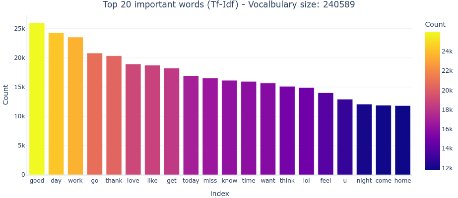
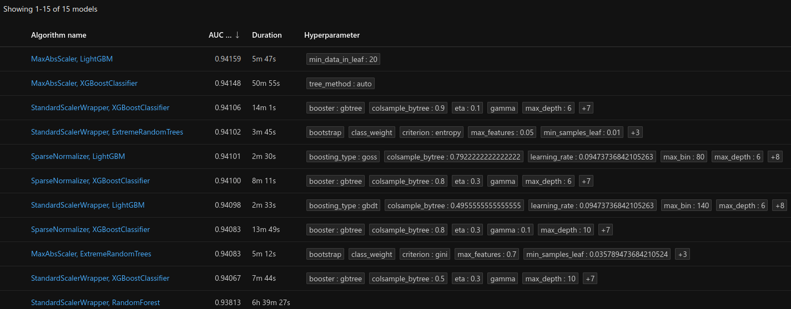
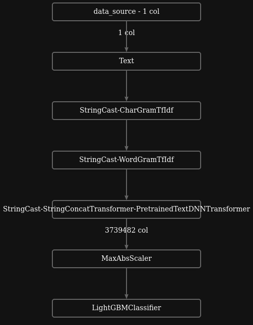
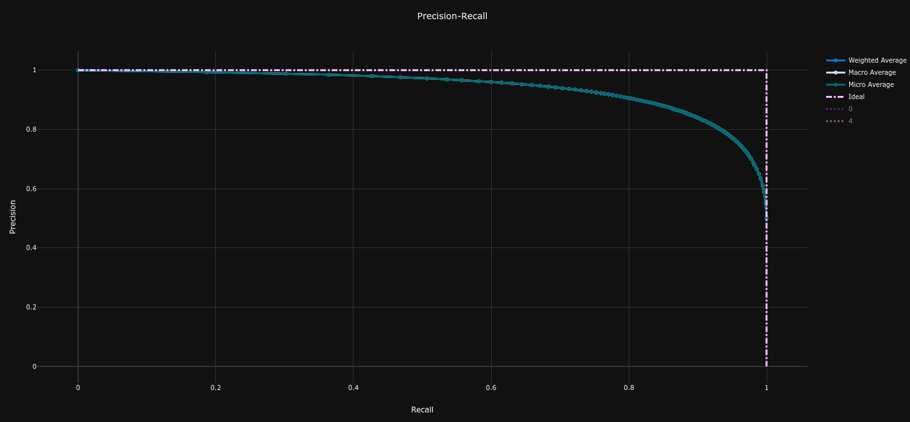

# Comparing Azure Tools for Sentiment Analysis

_Sentiment Analysis_ is one of the most classic [NLP] problems :

> Given a sentence, would you say its rather _POSITIVE_ or _NEGATIVE_ ?

This questions seems so simple at first ! It seems almost natural to our human mind to classify simple sentences :

> "I love my friends because they make me happy everyday!" 👍

> "My dog died today, I'm so sad..." 👎

But not all sentences are so "simple".

> "She had some amazing news to share but nobody to share it with." 🤔

There are multiple challenges that can make this task much more difficult :

- **language** : the given sentence could be in any language, potentially one you don't understand
- **language quality** : even if you know the language, the sentence could be written in a very un-intelligible way (with spelling, conjugation, grammar, syntax errors, ...)
- **language technique** : even in a perfectly well written English, the author could use a rhetorical device to imply a different meaning than the literal sense of the words (humor, derision, irony, sarcasm, ...)
- **context** : taking a sentence out of its context can completely change its meaning
- **subjectivity** : different people will interpret the same sentence differently depending on their personal way of thinking

Now, imagine you are the head of [PR] for a famous company. You want to prevent all the "bad buzz" that could affect the image of your company.
To do this, you need to monitor what people say on the Internet and be able to detect _NEGATIVE_ messages concerning your company in order to act before the word spreads.

In this post, we are going to cover different **Azure** services that we can use to predict the sentiment of **tweets**.

All the code is available on [GitHub].

---

- [Comparing Azure Tools for Sentiment Analysis](#comparing-azure-tools-for-sentiment-analysis)
  - [Exploratory Data Analysis](#exploratory-data-analysis)
    - [Target variable](#target-variable)
    - [Text variable](#text-variable)
      - [Length](#length)
      - [Words importance](#words-importance)
      - [Topic modeling](#topic-modeling)
  - [AI as a Service](#ai-as-a-service)
    - [Data preparation](#data-preparation)
    - [Model selection](#model-selection)
    - [Model training](#model-training)
    - [Classification results](#classification-results)
    - [Pros](#pros)
    - [Cons](#cons)
  - [AzureML Studio's [Automated ML]](#azureml-studios-automated-ml)
  - [AzureML Studio's [Designer]](#azureml-studios-designer)
  - [AzureML Studio's [Notebooks]](#azureml-studios-notebooks)

---

## Exploratory Data Analysis

Complete code available in [notebook.ipynb](https://fleuryc.github.io/OC_AI-Engineer_P7_Detect-bad-buzz-with-deep-learning/notebook.html)

In this section, we are going to perform an [EDA] to understand the data and the target variable.

The data we are going to use is [Kaggle - Sentiment140] dataset :

- 1.6 million tweets : low language quality : many Twitter specific words ("RT", @username, #hashtags, urls, slang, ... )
- target : binary categorical variable representing the sentiment of the tweet
  - `0` = negative
  - `4` = positive

### Target variable

The target variable is perfectly balanced.

### Text variable

#### Length

There are no big difference between the _POSITIVE_ and _NEGATIVE_ tweets, but _NEGATIVE_ tweets are slightly longer than POSITIVE tweets.

In both classes, there are two modes : ~45 characters and 138 characters (the maximum allowed at some point).

There are no big difference between the _POSITIVE_ and _NEGATIVE_ tweets, but _NEGATIVE_ tweets are significatively longer than _POSITIVE_ tweets. In both classes, there are two modes : ~7 words and ~20 words.

#### Words importance

After cleanig the text (lowercase, stopwords, [SpaCy lemmatization]), we can see the most common words ([Tf-Idf] weighted) in the dataset :

#### Topic modeling

Running a [LSA] on the cleaned text, we can identify **topics** :

Running a simple [Logistic Regression] on the dataset, we can measure the **importance** of each topic towards the target variable :

We can see that the most important topics are :

- _NEGATIVE_ topics :
  - topic #3 : "work"
  - topic #6 : "miss"
  - topic #10 : "want", "get", "home", "sleep"
- _POSITIVE_ topics :
  - topic #2 : "thank"
  - topic #7 : "love"
  - topic #4 : "work", "good", "morning", "thank"
  - topic #8 : "go", "love", "sleep", "bed"

## Protocol

We are going to split our dataset into a _train_ and a _test_ datasets, and compare the classification results according to different [binary classification metrics] :

- **Confusion Matrix** : common way of presenting _True Positive (TP)_, _True Negative (TN)_, _False Positive (FP)_ and _False Negative (FN)_ predictions.
- **Precision** : measures how many observations predicted as positive are in fact positive.
- **Recall** or **Sensitivity** : measures how many observations out of all positive observations have we classified as positive.
- **Specificity** : measures how many observations out of all negative observations have we classified as negative.
- **Accuracy** : measures how many observations, both positive and negative, were correctly classified.
- **F1-score**: combines _Precision_ and _Recall_ into one metric.
- **Average Precision (AP)** : average of precision scores calculated for each recall threshold.
- **ROC AUC** : tradeoff between _True Positive Rate (TPR)_ and _False Positive Rate (FPR)_.

## AI as a Service

Complete code available in [3_azure_sentiment_analysis.ipynb](https://fleuryc.github.io/OC_AI-Engineer_P7_Detect-bad-buzz-with-deep-learning/3_azure_sentiment_analysis.html)

In this section, we are going to evaluate Azure's [AIaaS] fully-managed cloud service : [Azure Cognitive Services - Sentiment Analysis API].

Before using Azure's Sentiment Analysis API, you need to create a Language resource with the standard (S) pricing tier, as explained in the [Quickstart: Sentiment analysis and opinion mining].

### Data preparation

Using a Azure's Sentiment Analysis API does not require any data preparation.
You just need to send the text you want to analyze to the API, and it will return the most likely sentiment label (_POSITIVE_, _NEGATIVE_ or _NEUTRAL_), as well as confidence scores for each label.

### Model selection

Azure's fully managed Cognitive Service is a black box. It uses Microsoft's best AI models to perform the analysis, but we have no control over it.

The best information we can get is from Azure's documentation, especially [Transparency note for Sentiment Analysis].

### Model training

The underlying model is pre-trained and we can't train or fine-tune it ourselves.

### Classification results

We ony tested the model on (only) 10,000 tweets in order to limit the cost of this experiment.

- **Accuracy** : 0.714400
- **F1** : 0.729135
- **Precision** : 0.693362
- **Recall** or **Sensitivity** : 0.768800
- **Specificity** : 0.660000
- **Average Precision** : 0.74
- **ROC AUC** : 0.77

### Pros

- no Data Science or Machine Learning experience required
- always using Microsoft's up-to-date state-of-the-art model
- very easy to set-up and use
- no additional costs (model selection, training, deployment, ...)
- very cheap for small projects (cf. [Cognitive Service for Language pricing])
- possible to make use of additional features like [Opinion Mining] to improve the understanding of the text's miwed sentiments

### Cons

- no control over the model
- the model is not well-balanced (training an other classification model on top of the confidence scores could prevent this bias)
- cost can become high for large projects (cf. [Cognitive Service for Language pricing])
- not suitable for critical or highly confidential data (though the model can be deployed on-premise : [Install and run Sentiment Analysis containers])
- requires an HTTP call to the API, which introduces a latency and potential security risks (though the API can be deployed on-premise : [Install and run Sentiment Analysis containers])

## Automated ML

Complete code available in [6_azureml_automated_ml.ipynb](https://fleuryc.github.io/OC_AI-Engineer_P7_Detect-bad-buzz-with-deep-learning/6_azureml_automated_ml.html)

In this section, we are going to evaluate AzureML Studio's [Automated ML].

Before using the service, you need to create a [Workspace], as explained in the [Tutorial: Train a classification model with no-code AutoML in the Azure Machine Learning studio].

### Data preparation

Using a Azure's Automated ML service does not require any data preparation.
The data has just to be imported in the *Workspace* as a [Dataset].

### Model selection

This where the magic actually happens.

The Automated ML service will automatically build, train and optimize hyper-parameters of many [Feature Engineering] methods and *classification models*.

For this experiment, we chose to use the following options :
- *Deep Learning Featurization* : **Enabled** (requires GPU capability)
  - this option is specific to text pre-processing and will integrate a BERT model to extract the embeddings of the words in the text (cf. [BERT integration in automated ML])
- *Primary metric* : **AUC weighted**
- *Training job time (hours)* : **10 hours** (in order to limit the cost of this experiment)

### Model training

Each model created by the Automated ML service is trained automatically, nothing to do here.

### Classification results

The service has tested and compared multiple algorithms before selecting the best one :

The best model is a [LightGBM] with [MaxAbsScaler], with a fine-tuned BERT model :

| Confusion Matrix | Precision Recall Curve (AP = 0.942) | ROC Curve (AUC = 0.942) |
|---|---|---|
|  |  |  |

- **Accuracy** : 0.867137
- **F1** : 0.867608
- **Precision** : 0.870689
- **Recall** or **Sensitivity** : 0.864549
- **Specificity** : 0.869763
- **Average Precision** : 0.942
- **ROC AUC** : 0.942

### Pros

- the classification results are very good
- the model is very well balanced
- the model is actually fitted to your domain data
- no Data Science or Machine Learning experience required, but you must be familiar with using cloud services
- limited cost : once the best model has been identified, re-training it can be quite fast and in-expensive

### Cons

- the AutoML experiment can be expensive (but controlled) : you need to pay for the training and evaluation of many models before the best one is identified
- once the best model has been identified, you need to deploy it to be able to use it in production, which requires Cloud Infrastructure skills

## AzureML Studio's [Designer]

## AzureML Studio's [Notebooks]

---

[nlp]: https://en.wikipedia.org/wiki/Natural_language_processing "Natural Language Processing"
[pr]: https://en.wikipedia.org/wiki/Public_relations "Public Relations"
[kaggle - sentiment140]: https://www.kaggle.com/kazanova/sentiment140 "dataset with 1.6 million tweets nad their sentiment"
[eda]: https://en.wikipedia.org/wiki/Exploratory_data_analysis "Exploratory Data Analysis"
[binary classification metrics]: https://towardsdatascience.com/the-ultimate-guide-to-binary-classification-metrics-c25c3627dd0a "Binary classification metrics"
[aiaas]: https://www.toolbox.com/tech/cloud/articles/artificial-intelligence-as-a-service/ "Artificial Intelligence as a Service"
[api]: https://en.wikipedia.org/wiki/API "Application Programming Interface"
[azure cognitive services - sentiment analysis api]: https://docs.microsoft.com/en-us/azure/cognitive-services/language-service/sentiment-opinion-mining/overview#sentiment-analysis "Azure Sentiment Analysis API"
[quickstart: sentiment analysis and opinion mining]: https://docs.microsoft.com/en-us/azure/cognitive-services/language-service/sentiment-opinion-mining/quickstart "Quickstart: Sentiment analysis and opinion mining"
[transparency note for sentiment analysis]: https://docs.microsoft.com/en-us/legal/cognitive-services/language-service/transparency-note-sentiment-analysis "Transparency note for Sentiment Analysis"
[cognitive service for language pricing]: https://azure.microsoft.com/en-us/pricing/details/cognitive-services/language-service/ "Cognitive Service for Language pricing"
[opinion mining]: https://docs.microsoft.com/en-us/azure/cognitive-services/language-service/sentiment-opinion-mining/overview#opinion-mining "Opinion Mining"
[install and run sentiment analysis containers]: https://docs.microsoft.com/en-us/azure/cognitive-services/language-service/sentiment-opinion-mining/how-to/use-containers "Install and run Sentiment Analysis containers"
[automated ml]: https://docs.microsoft.com/en-us/azure/machine-learning/concept-automated-ml "Azure Studio Automated ML"
[Tutorial: Train a classification model with no-code AutoML in the Azure Machine Learning studio]: https://docs.microsoft.com/en-us/azure/machine-learning/tutorial-first-experiment-automated-ml "Tutorial: Train a classification model with no-code AutoML in the Azure Machine Learning studio"
[Workspace]: https://docs.microsoft.com/en-us/azure/machine-learning/concept-workspace "Workspace"
[Dataset]: https://docs.microsoft.com/en-us/azure/machine-learning/concept-data#datasets "Dataset"
[Feature Engineering]: https://en.wikipedia.org/wiki/Feature_engineering "Feature Engineering"
[BERT integration in automated ML]: https://docs.microsoft.com/en-us/azure/machine-learning/how-to-configure-auto-features#bert-integration-in-automated-ml "BERT integration in automated ML"
[LightGBM]: https://lightgbm.readthedocs.io/en/latest/pythonapi/lightgbm.LGBMClassifier.html "LightGBM"
[MaxAbsScaler]: https://scikit-learn.org/stable/modules/generated/sklearn.preprocessing.MaxAbsScaler.html "MaxAbsScaler"
[designer]: https://docs.microsoft.com/en-us/azure/machine-learning/concept-designer "Azure Studio Designer"
[notebooks]: https://docs.microsoft.com/en-us/azure/machine-learning/how-to-run-jupyter-notebooks "Azure Studio Notebooks"
[github]: https://github.com/fleuryc/OC_AI-Engineer_P7_Detect-bad-buzz-with-deep-learning "Air Paradis : Detect bad buzz with deep learning"
[spacy lemmatization]: https://spacy.io/usage/linguistic-features#lemmatization "SpaCy lemmatization"
[tf-idf]: https://en.wikipedia.org/wiki/Tf%E2%80%93idf "Term frequency - Inverse document frequency"
[lsa]: https://en.wikipedia.org/wiki/Latent_semantic_analysis "Latent semantic analysis"
[logistic regression]: https://en.wikipedia.org/wiki/Logistic_regression "Logistic regression"
